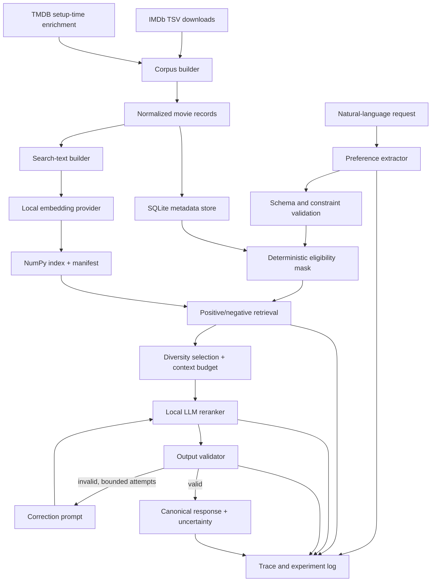

# Local Semantic Engine — Version 1 Implementation Specification

**Status:** Approved for implementation review
**Specification date:** 2026-08-01
**Target platform:** Windows, single-user workstation
**Initial demonstration:** Local movie recommendation over an approximately 1,000-movie catalogue

## 1. Purpose

Build a modular application framework that makes a locally hosted, instruction-tuned language model useful for reliable semantic tasks. Version 1 will prove the complete architecture through a movie recommender. Later releases will reuse the same core for extraction, summarization, rewriting, document question answering, tagging, routing, ranking, and stateless chat.

The project is an application framework around a pretrained model, not a model-training project. The framework must decide which work belongs to deterministic software and which work benefits from model inference.

The intended long-term shape has two layers:

1. A general local inference layer for text generation, streaming, embeddings, structured output, configuration, health checks, and telemetry.
2. Bounded task pipelines that add retrieval, deterministic rules, validation, correction, uncertainty reporting, and task-specific evaluation.

Version 1 implements the first layer and one production-shaped bounded pipeline: movie recommendation.

## 2. Product goals

Version 1 must:

- run inference and embeddings locally through Ollama;
- operate without a network connection after models and movie data have been installed;
- ingest and retain a recognizable local catalogue of approximately 1,000 movies;
- accept a natural-language movie request;
- extract likes, dislikes, and exact constraints;
- retrieve a small relevant candidate set without placing the full catalogue in the prompt;
- enforce catalogue membership and hard constraints in Python;
- rerank only supplied candidates with the local language model;
- return five validated recommendations with grounded reasons;
- expose uncertainty and data-coverage warnings without relying on an uncalibrated model confidence number;
- provide a Python library, command-line interface, and localhost HTTP API;
- implement model-output streaming in the inference layer and safe progress streaming in the recommendation API;
- log enough information to compare models, prompts, retrieval settings, and latency;
- establish extension seams so subsequent task types do not require replacement of the model, retrieval, validation, storage, or evaluation foundations.

## 3. Non-goals for Version 1

Version 1 will not:

- train or fine-tune a model;
- implement code generation or coding assistance;
- implement persistent chat memory;
- call cloud LLM providers or choose between local and cloud models;
- expose an OpenAI-compatible API;
- implement document ingestion or document Q&A;
- implement general summarization, rewriting, tagging, routing, or chat endpoints;
- implement agents, MCP clients, or arbitrary tool execution;
- perform live web search or automatic web retrieval during inference;
- implement FAISS or distributed retrieval;
- support multiple users, remote access, or authentication;
- implement a graphical user interface;
- implement an SSM backend;
- scrape IMDb pages or depend on an unofficial, unlicensed movie dump;
- guarantee that model-generated numeric scores are probabilities.

Web retrieval, MCP-based tools, other semantic pipelines, a UI, and alternative model architectures are later work. Version 1 will preserve narrow interfaces for them without implementing speculative orchestration.

## 4. Operating assumptions

### 4.1 Hardware

The reference workstation is:

- AMD Ryzen 5 5600X;
- 64 GB DDR4 system memory;
- NVIDIA RTX 3080 Ti with 12 GB VRAM;
- Windows 10 or Windows 11;
- a dedicated Conda environment on the project machine.

The runtime should keep the selected generation model fully on the GPU when practical. Large advertised context windows must not be treated as free: KV cache and prompt processing consume memory and time. The initial operational context target is 8,192 tokens, configurable after measurement.

### 4.2 Workload

- One active inference request is the default.
- The API may accept several connections, but generation requests are queued behind an application semaphore initially set to one.
- SQLite uses WAL mode so reads and logging do not unnecessarily block each other.
- No claim of parallel model speedup is made until a benchmark demonstrates it.

### 4.3 Network behavior

The system has two explicit modes:

- **Setup/ingestion mode:** may download packages, Ollama models, IMDb datasets, and TMDB enrichment data when invoked by the user.
- **Runtime mode:** performs recommendation entirely from local models and local data. It must not silently make network requests.

Startup must never download a model or refresh a dataset automatically.

## 5. Verified external constraints

The implementation must be based on the native Ollama HTTP API rather than undocumented behavior.

- Ollama runs natively on Windows and serves its local API at `http://localhost:11434` by default. Its Windows documentation also explains relocating model storage with `OLLAMA_MODELS`: [Ollama Windows documentation](https://docs.ollama.com/windows).
- The chat endpoint supports messages, JSON/JSON-schema output, streaming, generation settings, keep-alive behavior, token counts, and latency fields: [Ollama chat API](https://docs.ollama.com/api/chat).
- Ollama accepts a JSON schema through the `format` field, but application-side Pydantic validation is still required: [Ollama structured outputs](https://docs.ollama.com/capabilities/structured-outputs).
- Ollama supports batch embedding; `/api/embed` returns normalized vectors, and indexing and querying must use the same embedding model: [Ollama embeddings](https://docs.ollama.com/capabilities/embeddings).
- Ollama supports streamed text chunks. The client must accumulate and validate the completed response where structured output is required: [Ollama streaming](https://docs.ollama.com/capabilities/streaming).
- IMDb's official non-commercial files are daily gzipped TSV datasets. They contain title basics and ratings, but no plot summaries: [IMDb non-commercial datasets](https://developer.imdb.com/non-commercial-datasets/).
- TMDB can locate a movie by IMDb ID and provide details, credits, and keywords. Its developer API requires a key, non-commercial use requires attribution, and locally cached setup-time responses must be treated according to its terms: [TMDB find by external ID](https://developer.themoviedb.org/reference/find-by-id), [movie details](https://developer.themoviedb.org/reference/movie-details), [credits](https://developer.themoviedb.org/reference/movie-credits), [keywords](https://developer.themoviedb.org/reference/movie-keywords), and [API/attribution FAQ](https://developer.themoviedb.org/docs/faq).

Licensing and attribution notices must appear in the README and, later, the UI credits. The repository must not commit third-party datasets unless their terms clearly permit redistribution.

## 6. Version 1 user journeys

### 6.1 Initial setup

1. The user creates the project Conda environment.
2. The user installs Ollama for Windows and configures its model directory if desired.
3. The user explicitly pulls one generation model and one embedding model.
4. The user supplies a TMDB read token in a local environment file or process environment.
5. The user runs a corpus build command.
6. The builder downloads the required IMDb files, selects the catalogue, enriches it from TMDB, validates it, writes a provenance manifest, and caches all successful source results.
7. The user runs the index command.
8. The user runs a smoke test and evaluation command before starting the API.

### 6.2 Recommendation

1. The user submits a request such as: “I want thoughtful science fiction like Arrival, not action-heavy, no graphic gore, under two hours.”
2. The language model extracts structured preferences and exact constraints.
3. Python validates the extraction and resolves referenced catalogue titles.
4. Deterministic filters establish the eligible catalogue.
5. Local embeddings score positive affinity and negative similarity separately.
6. Retrieval selects a broad candidate pool and then a diverse reranking set.
7. The language model ranks only those candidates and returns candidate IDs.
8. Python validates IDs, count, uniqueness, scores, reasons, and constraints.
9. A bounded correction pass runs if necessary.
10. The application resolves canonical titles from local storage and returns the result with warnings, uncertainty signals, and timings.

### 6.3 Debugging and evaluation

The user can rerun a request with debug output to inspect:

- extracted preferences;
- title-resolution decisions;
- applied constraints and missing-data policy;
- retrieval scores and candidate IDs;
- context reductions;
- exact prompt versions and generation settings;
- validation and correction history;
- per-stage latency and Ollama token counts.

## 7. Architecture



### 7.1 Architectural rule

All domain facts displayed to the user must come from validated local records. Model output may choose IDs and compose reasons, but it may not establish catalogue membership, titles, runtimes, ratings, or genres.

## 8. Project layout

Use a modern `src` layout:

```text
X:\LLM\
├── src\local_semantic_engine\
│   ├── api\
│   │   ├── app.py
│   │   ├── dependencies.py
│   │   └── routes\recommendations.py
│   ├── cli\
│   │   ├── main.py
│   │   └── render.py
│   ├── config\
│   │   ├── models.py
│   │   ├── profiles.py
│   │   └── loader.py
│   ├── core\
│   │   ├── errors.py
│   │   ├── protocols.py
│   │   ├── result.py
│   │   └── timing.py
│   ├── llm\
│   │   ├── ollama.py
│   │   ├── structured.py
│   │   └── streaming.py
│   ├── embeddings\
│   │   ├── ollama.py
│   │   └── cache.py
│   ├── retrieval\
│   │   ├── numpy_index.py
│   │   ├── scoring.py
│   │   ├── diversity.py
│   │   └── budget.py
│   ├── storage\
│   │   ├── database.py
│   │   ├── movies.py
│   │   └── traces.py
│   ├── validation\
│   │   ├── structured_output.py
│   │   └── correction.py
│   ├── pipelines\
│   │   ├── base.py
│   │   └── movie_recommendation.py
│   ├── domains\movies\
│   │   ├── models.py
│   │   ├── prompts.py
│   │   ├── filters.py
│   │   ├── representation.py
│   │   └── uncertainty.py
│   ├── ingestion\movies\
│   │   ├── imdb.py
│   │   ├── tmdb.py
│   │   ├── selector.py
│   │   └── builder.py
│   └── evaluation\
│       ├── cases.py
│       ├── metrics.py
│       └── runner.py
├── data\
│   ├── raw\                 # ignored; source downloads and response cache
│   ├── processed\           # ignored by default; normalized local corpus
│   ├── indexes\             # ignored; NumPy matrix and manifest
│   └── evaluation\          # small, hand-authored cases may be committed
├── tests\
│   ├── unit\
│   ├── integration\
│   └── fixtures\
├── config\
│   └── default.toml
├── scripts\
│   └── verify_environment.ps1
├── pyproject.toml
├── .env.example
├── README.md
└── IMPLEMENTATION_SPEC.md
```

The package name is domain-independent. Movie-only behavior stays under `domains.movies`, `ingestion.movies`, and the movie pipeline.

## 9. Core interfaces

Interfaces are asynchronous because Ollama calls and API streaming are I/O-bound. The CLI may use `asyncio.run` at its boundary.

### 9.1 Language model provider

```python
class LocalLLM(Protocol):
    async def health(self) -> ProviderHealth: ...

    async def generate_text(
        self,
        messages: Sequence[ChatMessage],
        settings: GenerationSettings,
    ) -> GenerationResult: ...

    def stream_text(
        self,
        messages: Sequence[ChatMessage],
        settings: GenerationSettings,
    ) -> AsyncIterator[GenerationChunk]: ...

    async def generate_structured(
        self,
        messages: Sequence[ChatMessage],
        schema: type[T],
        settings: GenerationSettings,
    ) -> StructuredGenerationResult[T]: ...
```

`GenerationResult` must retain response text, model identity, duration fields, prompt/output token counts, finish reason, and trace metadata. Internal reasoning text, if a model exposes it, must not be returned through the public API or stored by default.

`GenerationSettings` includes the configured model, temperature, output-token cap, stop sequences, seed, context target, thinking mode, and keep-alive. Provider implementations translate these provider-independent fields to Ollama options.

Structured generation must pass the Pydantic JSON schema to Ollama and then independently parse and validate the completed text.

### 9.2 Embedding provider

```python
class EmbeddingProvider(Protocol):
    async def health(self) -> ProviderHealth: ...
    async def embed_texts(self, texts: Sequence[str]) -> EmbeddingBatch: ...
    async def embed_query(self, text: str) -> EmbeddingVector: ...
```

Every batch records provider, model, dimensions, normalization status, and elapsed time.

### 9.3 Vector index

```python
class VectorIndex(Protocol):
    def search(
        self,
        query: NDArrayFloat,
        *,
        top_k: int,
        eligible_ids: Collection[str] | None = None,
    ) -> list[ScoredId]: ...
```

The initial implementation uses a normalized `float32` NumPy matrix and dot products. The index manifest must reject mismatched embedding models, dimensions, preprocessing versions, and record hashes.

### 9.4 Pipeline

```python
class SemanticPipeline(Protocol[RequestT, ResponseT]):
    async def run(
        self,
        request: RequestT,
        context: PipelineContext,
    ) -> ResponseT: ...
```

`PipelineContext` contains the execution profile, trace ID, provider instances, repositories, clock, and debug permission. Future task pipelines should not import Ollama directly.

### 9.5 Future retrieval/tool seams

Do not implement these in Version 1, but reserve small contracts for later additions:

- `KnowledgeSource` produces provenance-bearing `EvidenceChunk` objects for document or web retrieval.
- `ToolProvider` exposes explicitly allowed tools; a later MCP adapter may implement it.

No agent loop or generic plugin registry is needed yet.

## 10. Configuration

Configuration precedence is:

1. built-in safe defaults;
2. `config/default.toml`;
3. optional user TOML path;
4. environment variables prefixed with `LSE_`;
5. permitted per-request overrides.

Secrets such as the TMDB token are environment-only and never written to traces.

Required groups:

- `ollama`: base URL, generation model, embedding model, timeouts, keep-alive;
- `generation`: context target, output cap, temperature, seed, thinking mode;
- `retrieval`: broad K, rerank K, positive/negative weights, quality bonus, diversity weight;
- `validation`: correction attempts, score bounds, missing-data behavior;
- `storage`: SQLite path, data paths, retention settings;
- `api`: host fixed to localhost by default, port, inference concurrency;
- `logging`: level, prompt/output capture, rotation/retention;
- `ingestion`: source URLs, selection rule, cache behavior, TMDB language.

### 10.1 Execution profiles

Profiles provide stable task-level behavior. Per-request overrides may reduce limits but may not bypass validation, localhost binding, corpus membership, or hard constraints.

| Setting | `fast` | `balanced` | `quality` |
|---|---:|---:|---:|
| Rerank candidates | 12 | 20 | 30 |
| Candidate summary cap | 220 chars | 400 chars | 650 chars |
| Maximum generated tokens per structured call | 400 | 700 | 1,000 |
| Temperature | 0 | 0 | 0–0.1 |
| Thinking mode | off | off by default | configurable |
| Correction attempts | 1 | 2 | 2 |
| Target context | 8,192 | 8,192 | 16,384 if benchmarked safe |

These are initial values to benchmark, not universal constants.

## 11. Model strategy

### 11.1 Generation model

Do not silently equate popularity or parameter count with suitability. Select the default model through a task-specific benchmark on the reference machine.

Initial candidates should include:

- a current approximately 8B instruction model as the latency baseline;
- a current approximately 12B quantized instruction model that fits in 12 GB VRAM with the configured context;
- one smaller model if it produces materially better latency without breaking structured reliability.

As of the specification date, reasonable official Ollama candidates include [`qwen3:8b`](https://ollama.com/library/qwen3:8b) and [`gemma4:12b`](https://ollama.com/library/gemma4:12b); these are benchmark candidates, not hard dependencies. Pin the winning model tag/digest in the local setup record so later model updates do not invalidate comparisons.

The chosen model must:

- remain fully GPU-resident at the operational context target, verified with `ollama ps`;
- follow the preference and reranking schemas reliably;
- copy supplied candidate IDs exactly;
- support a no-thinking or equivalent low-latency mode for fast/balanced profiles;
- have licensing acceptable for the intended personal project.

### 11.2 Embedding model

Start with [`embeddinggemma`](https://ollama.com/library/embeddinggemma) as a compact official Ollama candidate. Benchmark it against at least one alternative only if retrieval quality is inadequate. Persist the exact model identity and dimensions in the index manifest.

### 11.3 Warm and cold latency

Measure model-load time separately from request latency. The API health response should report whether the configured model is installed and whether it is currently loaded. Fast-profile latency targets apply to a warm model; cold-start results are recorded separately.

## 12. Movie corpus

### 12.1 Corpus definition

IMDb does not publish an official “Top 1000” dataset through its non-commercial files. To match the user's goal of recognizable, data-rich titles, Version 1 defines a transparent corpus named **IMDb Most-Voted 1000**:

1. Load `title.basics.tsv.gz` and `title.ratings.tsv.gz` from IMDb's official dataset endpoint.
2. Join on `tconst`.
3. Keep `titleType == "movie"` and `isAdult == 0`.
4. Require a title, release year, and positive vote count; runtime and genre may be missing.
5. Sort by `numVotes` descending, then `averageRating` descending, then `tconst` ascending for deterministic ties.
6. Select the first 1,000 records.

This prioritizes familiar and well-documented movies. It must not be described as IMDb's official top-rated chart. The selection strategy lives behind a `MovieSelector` so a weighted-rating or custom catalogue can replace it later.

### 12.2 Enrichment

For each selected IMDb ID:

1. Resolve the corresponding TMDB movie with the `/find/{imdb_id}` endpoint.
2. Fetch movie details in `en-US`.
3. Fetch TMDB credits and keywords when available.
4. Cache the raw response keyed by provider, endpoint, external ID, language, and retrieval date.
5. Normalize the response into the local record.

Failed or ambiguous matches must be recorded, not guessed. The builder may continue with IMDb-only fields if the record still validates. It emits a completeness report.

### 12.3 Optional MovieLens tag enrichment

The default corpus uses no raw review text. An explicit, opt-in MovieLens adapter may match selected IMDb IDs through MovieLens links and aggregate short user tags or high-relevance Tag Genome labels into provenance-marked semantic attributes. This is valuable for tone, pacing, and preference terms such as “atmospheric” or “thought-provoking,” but it is not required to build the first corpus.

Use MovieLens only under its non-commercial/research terms and do not commit or redistribute the downloaded dataset. Raw tags are compact metadata; raw reviews remain disabled by default. TMDB user reviews are also opt-in and, if later enabled, must be locally summarized into a controlled attribute vocabulary rather than inserted verbatim into embeddings or reranking prompts.

### 12.4 Record schema

```python
class MovieRecord(BaseModel):
    id: str  # stable local ID, normally IMDb tconst
    title: str
    original_title: str | None
    year: int | None
    genres: list[str]
    runtime_minutes: int | None
    imdb_rating: float | None
    imdb_vote_count: int | None
    overview: str
    original_language: str | None
    production_countries: list[str]
    directors: list[str]
    principal_cast: list[str]
    keywords: list[str]
    collection_id: str | None
    semantic_attributes: SemanticAttributes
    source_refs: list[SourceReference]
    field_provenance: dict[str, FieldProvenance]
    content_hash: str
    schema_version: str
```

Mutable list fields use `default_factory=list`, never shared list defaults.

### 12.5 Semantic attributes and warnings

IMDb/TMDB do not provide authoritative coverage for tone, pacing, themes, gore, jump scares, or similar attributes. Version 1 may run an explicit, offline enrichment command that derives a controlled vocabulary from overview, genres, and source keywords. Derived values must be marked `inferred`, include the prompt/model version, and never be presented as verified facts.

Content constraints use three-valued evidence: `present`, `absent`, or `unknown`.

- A direct source keyword can establish `present` for a mapped warning.
- Missing keywords cannot establish `absent`.
- Model inference can influence soft ranking but cannot silently satisfy a strict hard exclusion.
- For a hard exclusion such as “absolutely no gore,” the default policy excludes records with `present` or `unknown` evidence and warns if this reduces the pool.
- For a soft dislike such as “prefer not to have gore,” `unknown` records remain eligible but contribute to uncertainty.

This prevents missing metadata from being mistaken for safety.

### 12.6 Provenance manifest

The processed corpus manifest records:

- build ID and timestamp;
- selected IMDb file URLs, refresh dates, and SHA-256 hashes;
- TMDB language and retrieval window;
- selection algorithm and version;
- counts for selected, enriched, partial, ambiguous, and failed records;
- schema and preprocessing versions;
- attribution and non-commercial-use notices.

## 13. Searchable representation and embeddings

Build one compact representation per movie from validated fields:

```text
Title: Arrival (2016)
Genres: Drama, Mystery, Science Fiction
Overview: ...
Director: Denis Villeneuve
Cast: Amy Adams, Jeremy Renner, Forest Whitaker
Keywords: linguistics, first contact, nonlinear time
Runtime: 116 minutes
IMDb rating: 7.9 from 800000 votes
Derived themes: communication, grief, time [inferred]
Derived tone: thoughtful, atmospheric [inferred]
```

Requirements:

- normalize Unicode and whitespace;
- remove HTML and duplicate fragments;
- cap each field deterministically;
- preserve negation and constraint-relevant terms;
- omit empty labels;
- version the renderer;
- hash the rendered text;
- embed only changed records;
- batch requests to Ollama;
- write the matrix atomically only after the whole build validates.

Index files:

- `movie_vectors.npy`: normalized `float32` matrix;
- `movie_ids.json`: row-to-ID mapping;
- `movie_index_manifest.json`: model, dimensions, record hashes, renderer version, timestamps, and build ID.

## 14. Request and response models

### 14.1 Input

```python
class MovieRecommendationRequest(BaseModel):
    query: str
    count: int = Field(default=5, ge=1, le=10)
    profile: Literal["fast", "balanced", "quality"] = "balanced"
    debug: bool = False
    missing_data_policy: Literal["strict", "allow_with_warning"] = "strict"
```

The API imposes a configurable input length limit; the initial limit is 8,000 characters.

### 14.2 Extracted preferences

```python
class MoviePreferences(BaseModel):
    positive_preferences: list[str]
    negative_preferences: list[str]
    hard_constraints: MovieHardConstraints
    soft_constraints: MovieSoftConstraints
    liked_title_mentions: list[str]
    disliked_title_mentions: list[str]
    ambiguities: list[str]
```

Hard constraints use typed fields rather than an arbitrary dictionary:

- minimum/maximum runtime;
- minimum/maximum year;
- included/excluded genres;
- allowed/excluded languages;
- minimum IMDb rating;
- excluded content attributes;
- excluded catalogue IDs.

Unknown keys are forbidden. Numeric bounds are range-checked. The extractor must preserve exact values and must not convert “prefer” into a hard constraint.

### 14.3 Output

```python
class RecommendationItem(BaseModel):
    item_id: str
    title: str  # filled from storage, not trusted from the LLM
    year: int | None
    score: int = Field(ge=0, le=100)
    reason: str
    matching_attributes: list[str]
    possible_mismatches: list[str]


class UncertaintyReport(BaseModel):
    uncertain: bool
    reasons: list[str]
    missing_evidence: list[str]


class MovieRecommendationResponse(BaseModel):
    recommendations: list[RecommendationItem]
    uncertainty: UncertaintyReport
    warnings: list[str]
    trace_id: str
    timings_ms: dict[str, float]
    profile: str
    debug: RecommendationDebug | None = None
```

The language model returns only `item_id`, `score`, `reason`, `matching_attributes`, and `possible_mismatches`. The application adds canonical titles and years.

## 15. Recommendation pipeline

### 15.1 Preference extraction

Use structured generation with temperature zero and an explicit schema. Prompt rules require the model to:

- preserve exact numeric limits;
- distinguish strict words such as “must,” “only,” and “under” from preferences;
- separate positive and negative preferences;
- copy mentioned titles without resolving them;
- return empty arrays instead of inventions;
- list ambiguities rather than silently choosing an interpretation.

After model validation, Python normalizes constraint units and resolves title mentions against the catalogue using:

1. exact case-insensitive title and year;
2. normalized exact title;
3. conservative fuzzy match with a minimum score and clear winner margin;
4. unresolved/ambiguous result rather than guessing.

Resolved liked items contribute their searchable representations to positive retrieval. Disliked items contribute to negative retrieval and are excluded by ID.

### 15.2 Deterministic eligibility

Apply cheap hard constraints to all records before top-K selection. This avoids losing relevant results when an initial top-K contains many ineligible movies.

Filters must cover all typed hard constraints and the selected missing-data policy. The final validator repeats the checks after reranking.

If fewer than the requested number remain, return a controlled `INSUFFICIENT_ELIGIBLE_ITEMS` result with an explanation; do not relax constraints automatically.

### 15.3 Retrieval

Construct separate query texts:

- a positive query from explicit positive preferences, overall intent, and resolved liked items;
- a negative query from explicit dislikes and resolved disliked items.

Score every eligible record with a configurable formula:

```text
base_score = positive_similarity
           - negative_weight * max(0, negative_similarity)
           + quality_weight * normalized_quality
```

`normalized_quality` is an optional bounded feature derived deterministically from IMDb rating and log-scaled vote count. It must never dominate semantic similarity.

Retrieve 100 broad candidates by default. Log each score component separately.

### 15.4 Diversity and rerank-set selection

Select 12–30 reranking candidates according to profile. Use deterministic maximum marginal relevance over embedding similarity, with optional penalties for repeated collection/franchise and excessive genre concentration.

Diversity must not reintroduce an ineligible item.

### 15.5 Context budget

Before calling the reranker, estimate prompt size conservatively and reserve the configured output allowance. If over budget:

1. remove optional cast and source details;
2. shorten overview and keyword lists;
3. shorten inferred semantic attributes;
4. reduce candidate count while preserving the highest-scored candidates and a minimum diversity quota;
5. fail with a controlled context error if the required instructions, constraints, IDs, and minimum candidates still do not fit.

Never remove hard constraints or candidate IDs. Record every reduction. After generation, store Ollama's actual prompt token count to improve later estimates.

### 15.6 Reranking

The reranker receives:

- bounded system rules;
- the validated preferences;
- unresolved ambiguities;
- compact candidate JSON;
- the required response schema.

It must be instructed to:

- use only exact supplied IDs;
- recommend no more than the requested count;
- ground reasons only in supplied candidate fields;
- consider the whole request, not a single matching keyword;
- penalize dislikes and disclose possible mismatches;
- avoid asserting facts that are missing or merely inferred;
- treat scores as ordinal ranking aids, not probabilities;
- return JSON only.

### 15.7 Validation and correction

Validate:

- JSON parsing and schema;
- exact candidate membership;
- exact local catalogue membership;
- uniqueness;
- requested count;
- score range;
- hard-constraint compliance;
- title/reason length limits;
- references to unsupported attributes;
- grounding of matching attributes and mismatches.

On failure, send the invalid output, compact candidate IDs, schema, and enumerated validation errors through the bounded correction prompt. Do not repeat preference extraction. Maximum attempts come from the execution profile.

If correction fails, return `MODEL_OUTPUT_INVALID` with the trace ID. Raw invalid text appears only in debug logs, never as the application response.

### 15.8 Uncertainty

Set `uncertain=true` from deterministic signals, including:

- unresolved or ambiguous liked/disliked title mentions;
- missing evidence relevant to a stated dislike or constraint;
- too few strong retrieval matches;
- weak separation among retrieval scores;
- apparent conflicts among preferences;
- context reduction that removed useful optional evidence;
- any correction-loop use;
- fewer than the requested recommendation count;
- model-identified ambiguity that is supported by the input.

Thresholds must be configurable and evaluation-driven. Do not label the result with a probability unless a later calibration study justifies it.

## 16. Streaming behavior

The core Ollama client must implement `stream_text` and test chunk accumulation, cancellation, timeout, and disconnect behavior.

Structured recommendation output must not be released token-by-token because partial JSON has not passed validation. The API provides safe stage streaming through server-sent events:

```text
event: stage       data: {"name":"extracting_preferences"}
event: stage       data: {"name":"retrieving_candidates"}
event: stage       data: {"name":"reranking"}
event: warning     data: {...}
event: result      data: {validated MovieRecommendationResponse}
event: error       data: {controlled public error}
```

Only the final `result` event contains recommendations. This same inference streaming foundation can later serve chat, summarization, and rewriting endpoints.

## 17. Storage and observability

### 17.1 SQLite data

SQLite stores:

- normalized movie records and field provenance;
- corpus builds and index manifests;
- request traces;
- stage timings;
- prompt template versions;
- generation and embedding model identities;
- settings and profile;
- retrieved and reranked IDs with score components;
- raw model responses when logging enables them;
- validation errors and correction attempts;
- evaluation runs and metrics.

Do not store API tokens. Use schema migrations from the first revision, even if they are simple numbered SQL files.

### 17.2 Structured logs

Emit JSON-line application logs with trace IDs. Full prompts and model outputs are permitted for this project but remain independently configurable. Avoid duplicate storage of large payloads; a trace row may reference a compressed payload file by content hash.

### 17.3 Health

`GET /health` reports:

- application status and version;
- SQLite accessibility;
- corpus/index presence and compatible build IDs;
- Ollama reachability and version;
- configured generation and embedding model installation;
- currently loaded model when available;
- degraded conditions without leaking filesystem secrets.

## 18. API

Bind to `127.0.0.1`. Version 1 configuration validation must reject non-loopback hosts because remote security and authentication are out of scope.

Endpoints:

```text
GET  /health
POST /v1/recommendations/movies
POST /v1/recommendations/movies/stream
```

The non-streaming endpoint returns a validated JSON response. The streaming endpoint returns SSE stage events and a final validated result.

Public error shape:

```python
class ErrorResponse(BaseModel):
    code: str
    message: str
    trace_id: str
    retryable: bool
    details: list[str] = Field(default_factory=list)
```

Required error codes include:

- `INVALID_REQUEST`;
- `OLLAMA_UNAVAILABLE`;
- `MODEL_NOT_INSTALLED`;
- `MODEL_TIMEOUT`;
- `CORPUS_NOT_READY`;
- `INDEX_INCOMPATIBLE`;
- `INSUFFICIENT_ELIGIBLE_ITEMS`;
- `CONTEXT_BUDGET_EXCEEDED`;
- `MODEL_OUTPUT_INVALID`;
- `INTERNAL_ERROR`.

## 19. CLI

Expose one console command, tentatively `lse`, with subcommands:

```text
lse doctor
lse models list
lse corpus movies build
lse corpus movies inspect
lse index movies build
lse recommend movies "request text"
lse recommend movies "request text" --profile fast --debug
lse serve
lse evaluate movies
lse traces show TRACE_ID
```

`doctor` checks Python, configuration, disk paths, Ollama, installed models, GPU residency where observable, database, corpus, and index compatibility. It performs no downloads.

Normal recommendation output shows concise recommendations and warnings. Debug mode adds pipeline stages and scores but still does not expose hidden reasoning text.

## 20. Reliability requirements

- Use explicit connection and total timeouts for Ollama and setup-time data sources.
- Retry only transient failures with exponential backoff and jitter.
- Do not retry validation failures as transport failures.
- Support cancellation when the API client disconnects.
- Use atomic writes for manifests and indexes.
- Use file/build locks so two ingestion or indexing processes cannot corrupt artifacts.
- Detect duplicate IDs and conflicting source records.
- Validate embedding dimensions on every index load.
- Record and verify model digests when available.
- Set deterministic seeds where the model/runtime supports them.
- Sanitize model and dataset errors before returning them publicly.
- Limit query size, candidate count, reason length, and debug payload size.
- Keep localhost-only defaults and add no telemetry or analytics.

## 21. Testing strategy

### 21.1 Unit tests

Mock LLM and embedding providers. Cover at minimum:

- configuration precedence and invalid values;
- malformed or missing movie fields;
- `\\N` handling in IMDb TSV data;
- ambiguous and failed TMDB matches;
- deterministic top-1,000 selection and tie-breaking;
- duplicate IDs;
- searchable representation versioning and hashing;
- incremental embedding cache hits/misses;
- embedding dimension/model mismatch;
- exact and ambiguous title resolution;
- preference extraction schema failures;
- hard runtime/year/language/genre/rating filters;
- strict versus permissive missing content-warning policy;
- separate negative-preference scoring;
- diversity selection without constraint regression;
- context-budget reduction order;
- nonexistent/duplicate reranker IDs;
- unsupported claims in reasons;
- correction success, exhaustion, and bounded attempts;
- uncertainty signal derivation;
- timeout/retry classification;
- streamed chunk accumulation and cancellation;
- SSE emits no unvalidated recommendation data;
- API binds to loopback by default.

### 21.2 Integration tests without Ollama

Use deterministic fake providers to run:

- raw fixture to normalized corpus;
- corpus to NumPy index;
- request through extraction, retrieval, filtering, reranking, validation, storage, and response;
- invalid first response followed by successful correction;
- API and CLI against the same pipeline instance.

### 21.3 Optional local Ollama tests

Marked tests run only when explicitly enabled. They verify:

- generation and embedding health;
- JSON-schema output;
- exact candidate-ID copying;
- batch embeddings;
- streaming;
- one end-to-end movie request;
- installed-model latency and token accounting.

Tests must skip with a clear reason when Ollama or a configured model is unavailable.

## 22. Evaluation

Build the evaluation harness before prompt tuning so improvements are measurable.

### 22.1 Curated set

Create at least 30 English requests drawn from the final catalogue:

- 6 similarity-to-liked-title cases;
- 6 negative-preference cases;
- 6 numeric hard-constraint cases;
- 4 genre/language/year exclusion cases;
- 4 conflicting or ambiguous requests;
- 4 content-warning/missing-evidence cases.

Each case contains acceptable IDs, prohibited IDs, required constraints, and reviewer notes. The acceptable set need not identify a single perfect answer.

### 22.2 Baselines

Compare against:

- random eligible selection;
- most-voted eligible selection;
- embedding-only retrieval without LLM reranking.

### 22.3 Metrics

- preference schema-validity rate;
- first-pass and post-correction reranker validity;
- candidate-ID validity;
- hard-constraint violation rate;
- prohibited-item rate;
- retrieval recall at 100;
- hit rate at 5;
- acceptable recommendation rate;
- diversity measures;
- correction frequency;
- uncertainty frequency and reasons;
- warm/cold latency by stage;
- prompt and generated tokens;
- peak observed GPU/CPU placement where available.

### 22.4 Version 1 release gates

On the reference machine and pinned corpus/model configuration:

- exactly 1,000 validated catalogue records are built; failed enrichment produces partial records and a completeness warning rather than silently shrinking the catalogue;
- runtime recommendation succeeds with networking disabled;
- all successful responses are schema-valid and contain only catalogue IDs;
- invented-ID and duplicate-ID rates are 0%;
- known hard-constraint and prohibited-item violation rates are 0%;
- first-pass structured output validity is at least 95% over 100 repeated evaluation requests;
- post-correction validity is at least 99%, with all remaining failures returned as controlled errors;
- retrieval recall at 100 is at least 90% on cases with enumerated acceptable IDs;
- hit-at-5 is at least 70%, and acceptable recommendation rate is at least 60% on the curated set;
- hit-at-5 and acceptable recommendation rate each exceed the most-voted and random baselines by at least 10 percentage points;
- the warm `fast` profile targets median end-to-end latency at or below 5 seconds and p95 at or below 10 seconds;
- balanced and quality latency are reported, with no hard quality-profile latency gate;
- test coverage includes every reliability case in Section 21;
- the README enables a clean setup without undocumented steps.

The fast latency goal is a target, not permission to remove validation. If two necessary model calls make it unattainable, the evaluation report must identify the bottleneck and compare a safe optimization or smaller model.

## 23. Implementation stages and exit criteria

### Stage 0 — Environment and hardware smoke test

- Create the Conda environment and package skeleton.
- Install development dependencies.
- Verify native Ollama reachability and GPU use.
- Add `lse doctor` skeleton.

**Exit:** tests run; Ollama health can succeed or produce a controlled unavailable result.

### Stage 1 — Configuration, schemas, protocols, and storage

- Implement typed configuration and profiles.
- Implement shared results/errors and movie schemas.
- Initialize SQLite and migrations.
- Define provider/index/pipeline protocols.

**Exit:** configuration and schema unit tests pass; no model dependency required.

### Stage 2 — Ollama generation and embedding providers

- Implement health, chat, structured output, streaming, batch embeddings, timeouts, retry rules, and timing capture.
- Add fake providers.

**Exit:** provider unit tests pass; optional Ollama smoke tests demonstrate JSON schema, embeddings, and streaming.

### Stage 3 — Corpus acquisition and normalization

- Implement IMDb downloader/parser/selector.
- Implement TMDB resolver, details/keywords client, response cache, and attribution metadata.
- Normalize and validate movie records.
- Emit corpus and completeness manifests.

**Exit:** a small fixture builds offline; the real command produces the local approximately 1,000-movie corpus when credentials/network are available.

### Stage 4 — Representations, cache, and NumPy index

- Implement the renderer and content hashing.
- Implement incremental embedding cache and atomic index writes.
- Detect manifest mismatches.

**Exit:** exact vector search works; unchanged records are not re-embedded; mismatch tests pass.

### Stage 5 — Extraction, resolution, filters, and retrieval

- Implement preference prompt/schema.
- Resolve title mentions conservatively.
- Apply eligibility masks and missing-data policy.
- Implement positive/negative scoring, quality feature, and diversity.

**Exit:** mocked requests produce inspectable eligible and reranking candidate sets with all hard constraints enforced.

### Stage 6 — Reranking, validation, correction, and uncertainty

- Implement context budgeting and compact candidates.
- Implement reranking prompt and schema.
- Implement validators, bounded correction, canonical response assembly, and uncertainty signals.

**Exit:** full fake-provider pipeline returns five valid IDs and recovers from one deliberately malformed response.

### Stage 7 — CLI, API, and safe streaming

- Complete CLI commands and human-readable rendering.
- Implement health and recommendation endpoints.
- Implement inference queue and SSE stage/result events.

**Exit:** CLI and API use the same pipeline; SSE never leaks partial structured output; loopback binding is verified.

### Stage 8 — Evaluation, benchmark, tuning, and documentation

- Build curated cases and baselines.
- Benchmark model candidates and profiles on the reference hardware.
- Pin the selected local configuration.
- Tune prompts/retrieval weights only against recorded evaluation results.
- Complete README and troubleshooting.

**Exit:** Section 22 release gates are measured and results are saved; known limitations are documented.

Each stage must leave the project runnable and tested. Do not begin a later optional feature to hide a failed exit criterion.

## 24. Primary dependencies

Keep the dependency set small and pinned through `pyproject.toml` plus a reproducible lock/export:

- Python 3.11 or newer;
- Pydantic 2 and `pydantic-settings`;
- FastAPI and Uvicorn;
- HTTPX for Ollama and setup-time HTTP clients;
- NumPy;
- Typer or standard `argparse` for CLI behavior;
- pytest, pytest-asyncio, and HTTP test utilities;
- a small TOML/configuration stack using the standard library where possible.

Use the standard `sqlite3` module unless measured requirements justify an ORM. Do not introduce LangChain, LlamaIndex, a vector database, Redis, or a background job framework in Version 1.

## 25. README deliverables

The README must cover:

- product scope and limitations;
- architecture overview;
- Windows/Conda setup;
- native Ollama installation and model storage on the non-Windows drive;
- the distinction between Ollama and an Ollama-served model;
- explicit model pull commands after model selection;
- TMDB credential setup and attribution;
- IMDb non-commercial dataset terms;
- corpus build, index build, doctor, recommendation, API, and evaluation commands;
- runtime-offline verification;
- debug traces and data locations;
- how to replace the Ollama provider later;
- how to add a new bounded task pipeline;
- privacy implications of local prompt/output logging;
- known limitations in content warnings and inferred semantic attributes;
- hardware/context/latency tradeoffs;
- troubleshooting when Ollama is absent, a model is unloaded, or an index is incompatible.

## 26. Deferred roadmap

The following are deliberately outside the Version 1 release gate but supported by its boundaries:

1. Generic typed extraction and classification/tagging/routing pipelines.
2. Document loaders, chunking, citation-bearing local retrieval, and document Q&A.
3. Summarization and rewriting profiles.
4. Stateless chat API using caller-supplied history and `stream_text`.
5. A minimal web evidence provider with explicit user activation, source citations, content sanitization, request limits, and a locally hosted search option where practical.
6. Explicit tools and a possible MCP adapter after bounded tool permissions and validation are designed.
7. A local UI after the library, CLI, API, evaluation, and error behavior stabilize.
8. Optional FAISS or another index only when corpus size makes NumPy search insufficient.
9. Alternative generation backends through `LocalLLM`.

The web provider must remain distinct from the model provider. A local model should consume retrieved evidence without becoming coupled to a particular search service.

## 27. SSM note

SSM and hybrid model evaluation is deferred. The only Version 1 requirement is that an alternative backend can later implement `LocalLLM` without changes to movie ingestion, retrieval, validation, evaluation, or API schemas.

## 28. Definition of done

Version 1 is done when a new installation can follow the README to build the recognizable local movie corpus, build its local embedding index, run the pinned local model, and receive five catalogue-grounded recommendations through both CLI and localhost API. The system must enforce deterministic constraints, recover from a malformed model response, expose uncertainty and trace data, pass the release gates, and complete recommendation requests without network access.

Later task families may add adapters and schemas, but must not require redesigning the Version 1 provider, index, trace, validation, correction, or pipeline contracts.
